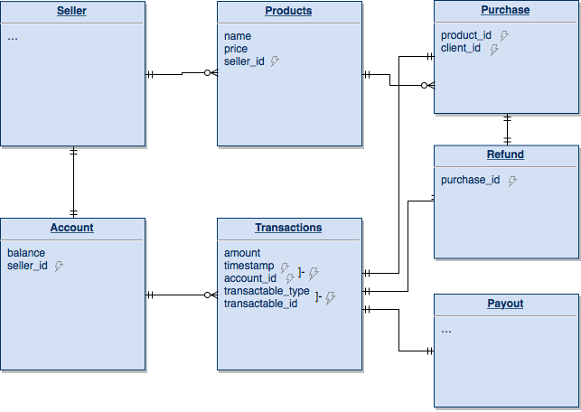

# Account balance data model

This design is based on the [_Event Sourcing_](https://martinfowler.com/eaaDev/EventSourcing.html) pattern. This means the relevant state (seller’s account balance) is captured as a sequence of events (transactions).

Every time a transaction occurs, it is stored as an immutable event which alters a seller‘s balance. The recording of the transaction and the update of the balance are performed as a synchronous atomic operation (SQL transactions) for consistency.

A transaction is of one of three types: `purchase`, `refund` and `payout`. The type of the transaction defines whether the amount is to be added or subtracted to the balance. The different types are shown as a polymorphic association on the transaction model, to store each type‘s specific data but a JSONB or serialized field on the `transactions` table could be used instead.

Since the balance is being updated only by each transaction, we have a cached value stored for it. However, the balance is easily reconstructed from the sequence of transactions. This could be useful to catch anomalies.

## Purchases and refunds

When a purchase is completed, a transaction object is created and persisted. This object is also responsible for updating the account of the associated seller. The seller‘s balance is credited with the amount of the sell. This happens inside a transaction to guarantee data integrity.

When a refund is issued a similar process takes place, only that the account is debited with the amount of the refund.

## Rolling payouts

To pay the sellers a process is run in which the current balance for each seller is calculated (from the history of transactions from the period) and then a transaction is created with that value and debited from the seller’s balance. That should leave every seller’s balance empty, immediately after payout.

## Indexes

The indexes are marked with lightning on the diagram. Most of them are on foreign keys for faster lookup of related objects, but more importantly, there‘s a composite index on `transactions.timestamp` and `transactions.account_id` to perform the calculation of balances from the history of transactions in a period as described above. There are also single-column ones on each of those fields in case we need to fetch all users’ transactions in a certain period, or all of a seller’s transactions regardless of date.

Another strategy to improve the performance of the payout process could be keeping a separate table for historic movements. The calculations would then be performed on a table that only keeps recent transactions for up to two weeks until the payout process is run, after which the table is wiped.
